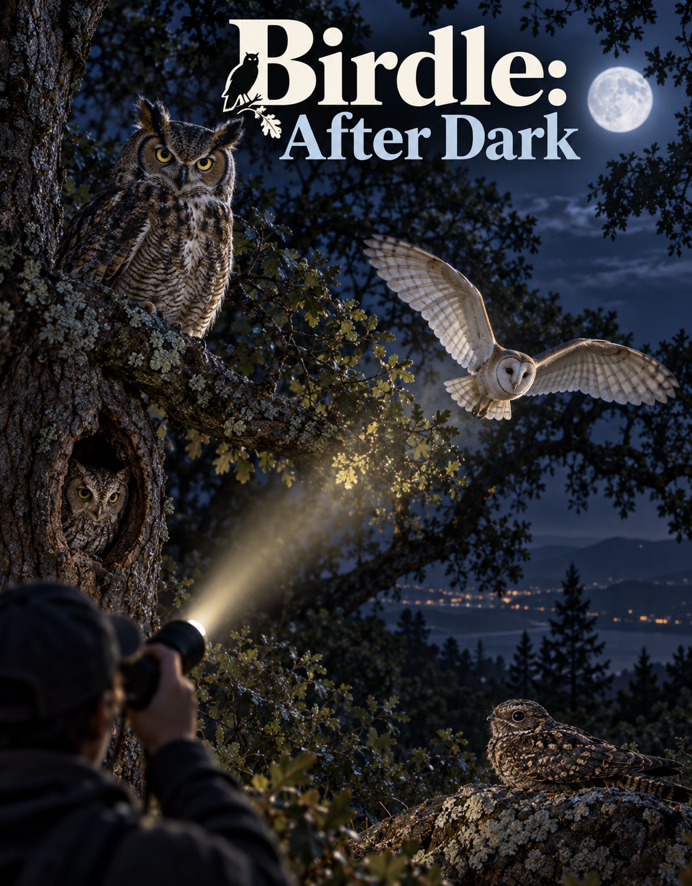

# birdle-after-dark

A small owl-themed browser game.

## Run locally

1. `npm install`
2. `npm run dev`
3. Open the displayed localhost URL.

## Android APK (offline play)

The game is wrapped with [Capacitor](https://capacitorjs.com/) so it can be
installed as an Android app. All game assets are bundled inside the APK, so it
plays fully offline (the online leaderboard just shows empty with no connection).

- **Download:** publish a GitHub release and CI builds the APK and attaches it
  as `BirdleAfterDark-<version>.apk` to the release (takes a few minutes).
  Manual runs of the "Android APK" workflow also produce a downloadable
  workflow artifact.
- **Build it locally:**
  1. `npm install`
  2. `npm run build && npx cap sync android`
  3. `cd android && ./gradlew assembleDebug`
  (Gradle needs Java 21, e.g. Android Studio's bundled runtime, plus the
  Android SDK.)
  The output lands at `android/app/build/outputs/apk/debug/app-debug.apk`
  (build outputs are gitignored).
- **Install it:** `adb install android/app/build/outputs/apk/debug/app-debug.apk`,
  or copy the APK to your phone and open it.
- **Icons/splash:** generated from `resources/icon.png` (the owl game icon) via
  `npx capacitor-assets generate --android --assetPath resources`.

Note: this is a debug-signed APK for sideloading. A Play Store release needs a
keystore-signed release build (`assembleRelease`/AAB).
